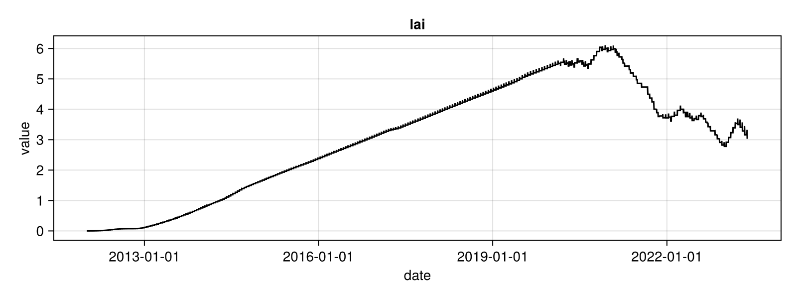
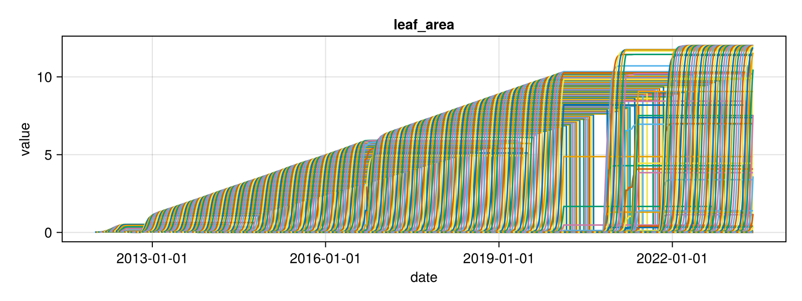
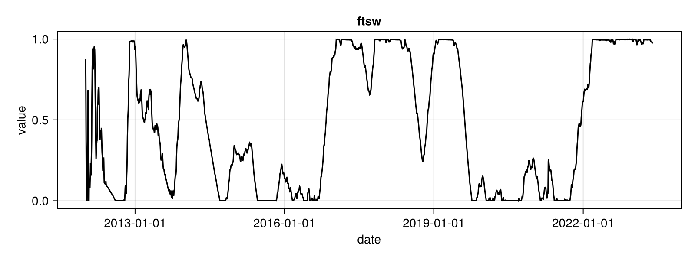

# XPalm - A Growth and Yield Model for Oil Palm 

<!-- [](https://PalmStudio.github.io/XPalmModel.jl/stable/) -->
[](https://PalmStudio.github.io/XPalmModel.jl/dev/)
[](https://github.com/PalmStudio/XPalmModel.jl/actions/workflows/CI.yml?query=branch%3Amain)
[](https://codecov.io/gh/PalmStudio/XPalmModel.jl)
[](https://github.com/SciML/ColPrac)

## Overview

XPalm is a process-based model for simulating oil palm (*Elaeis guineensis*) growth and development. The model simulates key physiological processes including:

- Phenology and development
- Carbon assimilation and allocation
- Water balance
- Reproductive organ development
- Yield components

XPalm implements a multiscale approach, modeling processes at different organizational levels:

Scene: Environment and canopy-level processes
Plant: Whole palm processes
Phytomer: Individual growth unit processes
Organ: Leaf, internode and reproductive organ processes

The model uses a daily time step and requires standard meteorological inputs (temperature, radiation, rainfall...).

The model is implemented in the [Julia programming language](https://julialang.org/), which is a high-level, high-performance dynamic programming language for technical computing. 

## Example outputs

Here are some example outputs from the model, showing the evolution of variables at different scales:

**Scene level:**

Leaf area index (LAI) at the scene level over time:



**Plant level:**

Maintenance respiration (Rm), absorbed PPFD (aPPFD), biomass of bunches harvested, and leaf area at the plant level over time:
 


**Leaf level:**

Leaf area at the level of the individual leaf over time:



**Soil level:**

Fraction of transpirable soil water (FTSW) over time:



## Installation

The package can be installed using the Julia package manager. From the Julia REPL, type `]` to enter the Pkg REPL mode and run:

```julia
pkg> add XPalmModel
```

To use the package, type the following in the Julia REPL:

```julia
using XPalmModel
```

## Quick Start

From the Julia REPL, load the package:

```julia
using XPalmModel
```

### The easiest way of running the model

The easiest way to run the model is to use the template notebook provided by the package. To run the notebook, you need to install the Pluto package first by running `] add Pluto`. Then, you can run the notebook using the following commands in the Julia REPL:

```julia
using Pluto, XPalmModel
XPalmModel.notebook("xpalm_notebook.jl")
```

This command will create a new Pluto notebook (named "xpalm_notebook.jl") in the current directory, and open it automatically for you.

Once closed, you can re-open this notebook by running the same command again. If the file already exists, it will be opened automatically.

### Programmatically running the model

#### Basic simulation

Run a simple simulation using default parameters and meteorological data:

```julia
using XPalmModel, CSV, DataFrames

# Load example meteorological data
meteo = CSV.read(joinpath(dirname(dirname(pathof(XPalmModel))), "0-data/meteo.csv"), DataFrame)

# Run simulation
df = xpalm(meteo; 
    vars = Dict("Scene" => (:lai,)), # Request LAI as output
    sink = DataFrame
)
```

!!! note
    You need to install the `CSV` and `DataFrames` packages to run the example above. You can install them by running `] add CSV DataFrames`.

#### Advanced Usage

Customize palm parameters and request multiple outputs:

```julia
# Read the parameters from a YAML file (provided in the example folder of the package):
using YAML
parameters = YAML.load_file(joinpath(dirname(dirname(pathof(XPalmModel))), "examples/xpalm_parameters.yml"); dicttype=Dict{Symbol,Any})

# Load example meteorological data
meteo = CSV.read(joinpath(dirname(dirname(pathof(XPalmModel))), "0-data/meteo.csv"), DataFrame)

# Create palm with custom parameters
p = XPalmModel.Palm(parameters=parameters)

# Run simulation with multiple outputs
results = xpalm(
    meteo,
    DataFrame,
    vars = Dict(
        "Scene" => (:lai,),
        "Plant" => (:leaf_area, :biomass_bunch_harvested),
        "Soil" => (:ftsw,)
    ),
    palm = p,
)
```

You can also import the parameters from a JSON file using the `JSON` package:

```julia
using JSON # You first need to install the JSON package by running `] add JSON`
params = open(joinpath(dirname(dirname(pathof(XPalmModel))), "examples/xpalm_parameters.json"), "r") do io
    JSON.parse(io; dicttype=Dict{Symbol,Any}, inttype=Int64)
end
```

!!! note
    The configuration file must contain all the parameters required by the model. Template files are available from the `examples` folder.

#### Importing the models

The models are available from the `Models` submodule. To import all models, you can use the following command:

```julia
using XPalmModel
using XPalmModel.Models
```

#### More examples

The package provides an example script in the `examples` folder. To run it, you first have to place your working directory inside the folder, and then activate its environement by running `] activate .`. 

You can also find example applications in the [Xpalm applications Github repository](https://github.com/PalmStudio/XPalm_applications).

## Funding

This work is supported by the PalmStudio research project, funded by the [SMART Research Institute](https://smartri.id/) and [CIRAD](https://www.cirad.fr/en).